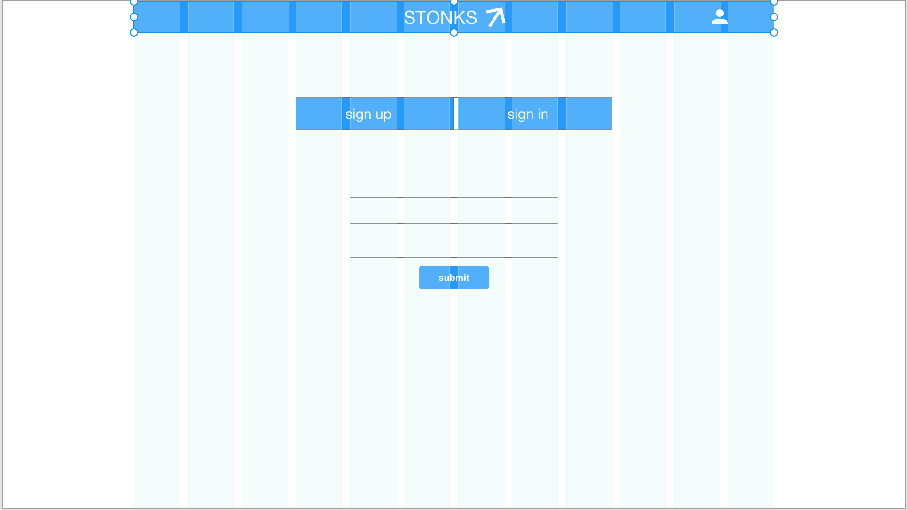

# Paper Trading App - Stonks
Stonks is an app designed with a goal to let people learn how to trade stocks with zero risk to lose money. In this app you can buy and sell real world stocks with virtual money.

The app takes in a stock symbol, volume and current price, checks if you have enough money available on your account, and creates a position, while reducing your account balance. WHen you close a position, it 'sells' the stocks with a current price and updates your balance.

## Technologies Used
* HTML5
* JavaScript
* Bootstrap 4
* React-bootstrap
* ReactJS
* Axios
* Alpha Vantage (3rd party API)
* Ruby on Rails back end

I used React for the App`s structure, creating multiple dynamically updating components that render data from both my back and and a third party API.
To connect front end to the back end and make API calls, I used axios.
To add better structure and UX, I used React Bootstrap.

 Links:
 - [Deployed Website](https://elinagorshkova.github.io/paper-trade-client/)
 - [Client Repo](https://github.com/elinagorshkova/paper-trade-client)
 - [API Repo](https://github.com/elinagorshkova/paper-trade-api)
 - [API Deployed](https://mysterious-tundra-15808.herokuapp.com/)

 ## Future Features
 - Dinamically update chart with real time data
 - Display profit/loss for total portfolio as well as for each position

 ## Process, Planning, Problem-Solving
 I started the project with brainstorming the back end structure. I researched a few existing stock market apps to determine what is a must-have in my own app. Then I created ERD for my future DataBase and moved to front end planning.
 For my front end I created a wireframe with AdobeXD, where I layed out all the vital element of the app.
 After finishing the planning steps, I moved to developing the back end. More details on that in my API README.

 Then I built the main REACT components for my front end and connected them to the back end with AXIOS calls. When this step was done, I integrated my app to a third party stock market API and displayed the fetched data on the front end with a chart.

 After these steps were successfully completed, I started to test my app for various bugs.

# Wireframe:

# User Stories:
User Stories

Authentication:

As a user, I want to:
Sign Up with a password and email
Sign In with a password and email

When signed in, as a User, I want to:
Change password with an old and a new password
Sign out

Main actions:

Only when signed in, as a user, I want to:

Create a trading account with initial amount of money and name
Delete a trading account
View my trading account (open positions and balance)
Add money to my account
 - Withdraw money from my account
Open a long/short position with a company ticker, shares volume and current share price
Close a long/short position with a company ticker, shares volume and current share price
See my total YTD profit/loss percentage
See my current position profit/loss $ amount
Stretch goals:

Connect to a finance API to get real charts and prices
Open multiple positions at a time
Implement limit and stop orders

# Screenshots

# Installation

* To enjoy the app
- Just open the deployed app, sign up and have fun!

* To work with the code:
- Fork and clone
- Run NPM install
- Feel free to use any part of teh code

## Status
Project is in progress.
Continue adding new features.

## License

This project is licensed under the terms of the MIT license. See the LICENSE file for details.

## Contact
Created by Elina Gorshkova(https://github.com/elinagorshkova, https://www.linkedin.com/in/egorshkova/) - feel free to contact me!
